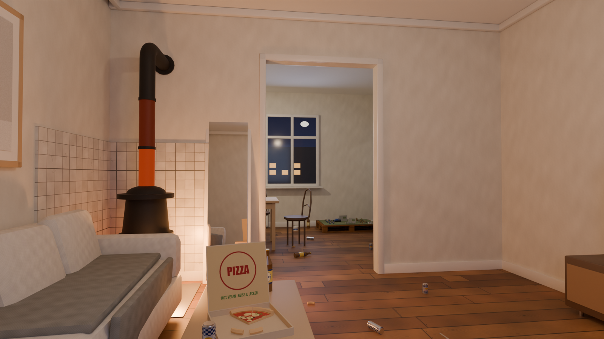

# Max' Wohnung – Rattenspiel

**Spielen:** https://simon23-12.github.io/maxratgame/ (hochkant auf dem Handy, mit Ton)



Eine Ratte wohnt heimlich in Max' Altbauwohnung. 3rd-Person, hochkant fuers Handy, 3 Level:

1. **Red-Bull-Rausch** – alle Energy-Dosen leertrinken, ohne Max zu wecken (Laermbalken).
2. **Operation Plastikkrieger** – 6 verstreute Warhammer-Figuren einzeln ins Versteck (Abstellkammer) tragen.
3. **Metal Gear Ratte** – Max ist wach (nur pinke Strumpfhose, Eimer). Unentdeckt zum Loch in der
   Schlafzimmerwand. Sichtkegel, Verdacht `?`, Alarm `!`, Suche, Soliton-Radar. Unter Bett/Couch unsichtbar.

Zeitlimits: Level 1 3:30, Level 2 5:00, Level 3 3:00. Musik ist komplett im Browser synthetisiert
(Polka im Menue, Zehenspitzen-Pizzicato beim Schleichen, Agenten-Thema + Alarm-Track in Level 3,
unter 30 Sekunden wird alles schneller).

Steuerung: Daumen unten aufsetzen + ziehen = laufen (weit = rennen, laut), oben wischen = Kamera,
Knopf rechts = Aktion. Desktop: WASD, Shift rennen, Maus = Kamera, Leertaste = Aktion.

## Pipeline
```
./build.sh                         # Texturen -> Blender (Bau + Licht-Bake + GLB) -> lightmap.webp
./build.sh --bake-samples 1024     # schoenerer Bake (dauert laenger)
./build.sh --render                # zusaetzlich Cycles-Standbilder nach renders/
npm --prefix web run dev           # Preview auf http://localhost:5173 (auch im WLAN fuers iPhone)
git push                           # GitHub Action baut web/ und veroeffentlicht auf GitHub Pages
```

| Datei | Inhalt |
|---|---|
| `tools/make_textures.py` | prozedurale Texturen (Dielen, Fliesen, Mate, Dosen, Quark, Pizza …) |
| `blender/build_apartment.py` | baut Grundriss, Moebel, Kram, Max, Lichter; backt Lightmap; exportiert GLB |
| `tools/encode_lightmap.py` | HDR-Lightmap -> 8-bit WebP (ohne neuen Bake nachjustierbar) |
| `web/public/assets/layout.json` | Raeume, Waende/Hindernisse (Kollision), Items, Versteck, Max |
| `web/src/main.js` | Spielablauf, Level, Laerm, Gegenstands-Physik, 3rd-Person-Kamera |
| `web/src/rat.js` / `max.js` | Ratte (Steuerung, Animation) / Max als Jaeger (KI, Wegpunkte, Eimer) |
| `web/src/world.js` | Laden, gebackene Materialien, Licht-Schaetzung fuer Figuren |
| `web/src/hud.js`, `input.js`, `audio.js`, `collision.js` | HUD + Radar, Touch/Tastatur, Synth-Sounds, 2D-Kollision |

iPhone-Optimierung: Licht ist komplett in Blender (Cycles) gebacken, im Browser laufen nur Unlit-Materialien
mit Lightmap (~52k Dreiecke, ~180 Draw-Calls, keine Echtzeit-Schatten).

Ratte und wacher Max sind Gelenk-Hierarchien im GLB (prozedural animiert, Echtzeitlicht).
Objekte im GLB tragen `userData.role`: `food` (Pizza, Pizzarand, Magerquark), `noise` (Dosen, Mate-Flaschen),
`obstacle` (Hanteln, Peitsche), `mini` (lose Figuren), `water`, `max`, `max_body` (atmet).
